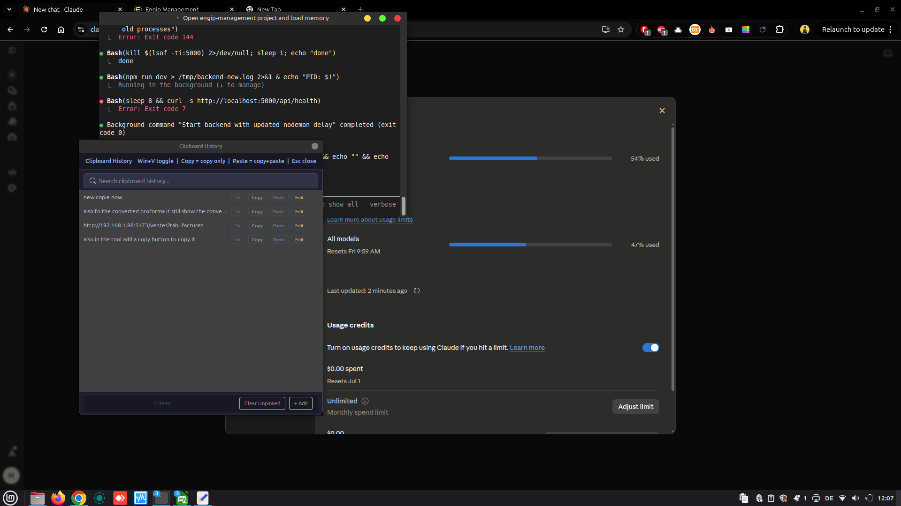

# Clipboard Manager

A lightweight background clipboard history tool for Linux (X11) built with Python + GTK3.  
Press **Win+V** anytime to see everything you've copied — search, pin, add, edit, and paste with one click.

---

## Screenshot



---

## Features

- **Win+V hotkey** — toggle the popup from anywhere, no window focus needed
- **Full history** — tracks up to 100 items automatically as you copy
- **Copy** — copies to clipboard without pasting (window stays open)
- **Paste** — copies + auto-pastes into whatever was focused before
- **Pin** — pin important items so they stay at the top and survive "Clear Unpinned"
- **Add** — manually add any text to your clipboard history for later
- **Edit** — edit any existing item inline via a modal dialog
- **Delete** — remove individual items or clear all unpinned at once
- **Search** — filter history in real time as you type
- **System tray icon** — always visible, right-click to quit
- **Persisted history** — survives reboots, stored in `~/.config/clipboard-manager/history.json`
- **Auto-start on login** — installed as a systemd-free autostart entry

---

## Requirements

| Dependency | How to get |
|---|---|
| Python 3.8+ | Pre-installed on most distros |
| GTK 3 Python bindings | `sudo apt install python3-gi` |
| xdotool | `sudo apt install xdotool` |
| pynput | `pip3 install pynput --break-system-packages` |

> Tested on **Linux Mint 21** and **Ubuntu 22.04** with X11.  
> Wayland is not supported yet (xdotool limitation).

---

## Install

```bash
git clone https://github.com/Dahbi-Dev/clipboard-manager.git
cd clipboard-manager
chmod +x install.sh
./install.sh
```

The install script:
1. Installs dependencies
2. Copies the binary to `~/.local/bin/clipboard-manager`
3. Creates `~/.config/autostart/clipboard-manager.desktop` so it starts on login
4. Launches it immediately

---

## Usage

| Action | How |
|---|---|
| Open / close popup | **Win+V** |
| Copy item (no paste) | Click **Copy** or click the row |
| Copy + paste item | Click **Paste** or press **Enter** |
| Pin item | Click **Pin** |
| Edit item | Click **Edit** — opens a modal with the full text |
| Delete item | Click **x** |
| Add new text manually | Click **+ Add** in the footer, type, click **Save** |
| Search | Just start typing in the search bar |
| Clear unpinned | Click **Clear Unpinned** in the footer |
| Close popup | **Esc** or click outside |

---

## How it works

```
┌─ Background process (always running) ──────────────┐
│  Polls clipboard every 500ms                        │
│  On change → prepends to history → saves JSON       │
│  pynput listener watching for Win+V                 │
└─────────────────────────────────────────────────────┘
         │  Win+V pressed
         ▼
┌─ GTK popup window ──────────────────────────────────┐
│  Search bar                                         │
│  ┌─ Pinned items ────────────────────────────────┐  │
│  │  [item text]   Pin  Copy  Paste  Edit  x      │  │
│  └───────────────────────────────────────────────┘  │
│  ┌─ History ─────────────────────────────────────┐  │
│  │  [item text]   Pin  Copy  Paste  Edit  x      │  │
│  │  ...                                          │  │
│  └───────────────────────────────────────────────┘  │
│  [ + Add ]  [ Clear Unpinned ]                      │
└─────────────────────────────────────────────────────┘
```

---

## File locations

| File | Purpose |
|---|---|
| `~/.local/bin/clipboard-manager` | Main executable |
| `~/.config/clipboard-manager/history.json` | Persisted history |
| `~/.config/autostart/clipboard-manager.desktop` | Login autostart |

---

## Contributing

Pull requests are welcome. See [CONTRIBUTING.md](CONTRIBUTING.md) for ideas and guidelines.

Some areas to build on:
- **Wayland support** via `wl-clipboard` + `ydotool`
- **Image clipboard support** (screenshots, etc.)
- **Categories / tags** for items
- **Export history** to file
- **Encrypted pinned items** (passwords)
- **Sync across machines** via a backend
- **Custom hotkey** setting via config file
- **AppIndicator** tray (better DE compatibility)

---

## License

MIT — see [LICENSE](LICENSE)
